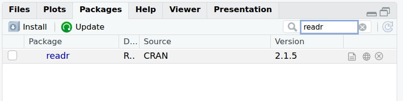

# Import data / read files / scripts

In this section, we will learn how to **import the content of a file** in R using the **{readr}** package (part of the **{tidyverse}**).

## Fetch workshop files

Let's copy locally a few files prepared for this workshop.

* Go to: <a href="https://github.com/sarahbonnin/DataViz_source_files" target="_blank">https://github.com/sarahbonnin/DataViz_source_files</a>

* Download the ZIP archive, as follows:

Click on  -> Download ZIP:


* Save the archive in the course folder (**DataViz_R**)

* Extract the archive (click right on the archive and you should see some extraction options).

What is extracted from the archive is the **DataViz_source_files-main** folder, which in turns contains a **files** folder: this contains the files we need for the course.

The **path** to fetch the files is the following (remember that the first piece is *OS/user* dependent):

*/your_home_directory/*DataViz_R/**DataViz_source_files-main/files**

e.g.

/users/sbonnin/DataViz_R/**DataViz_source_files-main/files**

## Import / read in data

### Load package into environment

From RStudio interface, in the **bottom-right panel** and **Packages** tab, search for the package name and **tick the box**:



From the R console:

```{r, echo=T, eval=F, message=F, warning=F}
library(readr)
```

### from CSV

Let's now import the content of a first file in our environment.

There are several ways we can specify the path / location of a file:

* Using the "absolute path":

```{r, echo=T, eval=F, message=F, warning=F}
# absolute path
geneexp <- read_csv(file="~/Documents/DataViz_R/DataViz_source_files-main/files/expression_20genes.csv")
```

* Using the "relative path" (i.e. relative to where the session and R project are currently located), e.g.:

```{r, echo=T, eval=T, message=F, warning=F}
# relative path (this assumes you are in the course folder)
geneexp <- read_csv(file="DataViz_source_files-main/files/expression_20genes.csv")
```

Because your **working directory** is **DataViz_R**, R can find the **DataViz_source_files-main** without needing the full path (**relative vs absolute path**).

The content of file **expression_20genes.csv** is now stored in the object named **geneexp**.

The function also outputs some information about the data you are importing:


Such as that:

* The data contains 20 rows (observations), and 4 columns (variables).
* Out of these 4 columns:
  * 2 contain characters (<span style="color: red;">chr</span>): **Gene** and **DE**.
  * 2 contain numbers (<span style="color: green;">dbl</span> for "double"): **sample1** and **sample2**

Notes:

* Objects you create can be found in the **Environment** tab in the upper-right panel.
* If you click on an object name in the **Environment** tab, it will open on the upper-left panel. Let's try with **geneexp**:


### from Excel

{tidyverse} provides the {readxl} package with functions to read in Excel files.

Although working with text files (.txt, .csv, .tsv etc.) is a better practice, you can import Excel files using the **read_excel()** function.

First, load the {readxl} package (bottom-right panel -> Packages -> search and tick readxl, or from the console, as shown below).

```{r}
library(readxl)
# Relative path:
read_excel(path="DataViz_source_files-main/files/expression_20genes.xlsx")
```

If your Excel file contains multiple sheets, you can specify the sheet name using the **sheet=** parameter:

```{r}
read_excel(path="DataViz_source_files-main/files/expression_20genes.xlsx",
           sheet="tab1")
```

**Note: parameters in a function are comma-separated**:

* *path* is a first parameter
* *sheet* is a second parameter

## Scripts

A **script** is a text file containing a set of **commands** and **comments**.

It can be saved, re-used later, and shared.

It is good practice to create a script and save all commands: let's create a script for this course.

*Go to File -> New File -> R script*


A new window will open in the upper-left panel.

Save the file in the course folder (you can name it, for example, *workshop.R*)

**Copy commands you will use during the course, and do not forget to save changes regularly!**

**TIP**: you can send a line or selected lines from the script to the console without copy-pasting: press CTRL+ENTER when highlighting the row.

**Note that, when you re-open an RStudio projects, scripts/files that were left open will open automatically**
