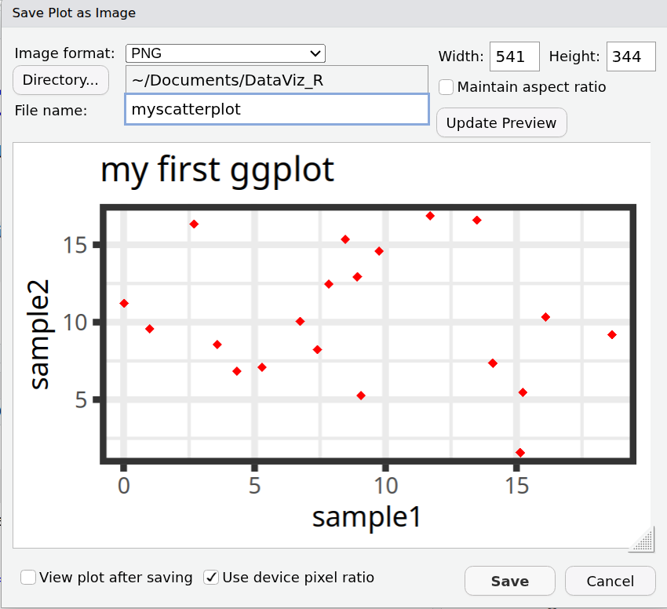

# ggplot2

```{r global_options, include=FALSE}
knitr::opts_chunk$set(fig.width=5, fig.height=4,
                      echo=TRUE, warning=FALSE, message=FALSE)
```

* Graphing package inspired by the **G**rammar of **G**raphics work of Leland Wilkinson:
  
* *The Grammar of Graphics is based on the idea that every graphic can be broken down into a series of components or layers. These components include the data, the aesthetic mapping, the geometric shapes, the statistical transformation, and the scales.* [source](https://medium.com/aiskunks/data-visualization-grammar-of-graphics-fccf78379b52)

* Flexible, versatile, customizable.

* Well documented.


*image from https://www.cedricscherer.com/img/ggplot-tutorial/overview.png*


## Getting started

A ggplot graph needs at least 3 components:

* **Data**: that is the source data that we want to represent.
* **Aesthetics** mappings: they describe what will be visualized from **data**. What are you trying to show?
* **Geometrics**: functions that represent what we see in the graph: lines, points, boxes etc. for example:
  * geom_point()
  * geom_lines()
  * geom_histogram()
  * geom_boxplot()
  * geom_bar()
  * geom_smooth()
  * geom_tiles()

The base structure is the following:

**ggplot(\<DATA\>, \<AESTHETICS\>) + \<GEOMETRICS\>**


For example if we want to represent **column1** (on the x axis) and **column2** (on the y axis) of **data** as **points**, we can use the following structure:

```{r, eval=F, echo=TRUE}
ggplot(data=dataframe, mapping=aes(x=column1, y=column2)) + geom_point()
```

This will be our template as we explore different types of graphs.

We can add **more layers and components** to this base structure to customize the plot: we will see examples throughout this course.

## Scatter plot

### Base plot

We can start from the **geneexp** object, that contains data from *expression_20genes.csv*: we will represent **sample1** on the x axis and **sample2** on the y axis.

The base layer is built as follows (Copy-paste this in the console, and hit Enter):

```{r, eval=T}
ggplot(data=geneexp, mapping=aes(x=sample1, y=sample2))
```

As you can see, nothing is plotted yet, but the base is set.

We then add a geometrics **geom_point()** to the base layer: this **tells ggplot to produce a scatter/point plot**:

```{r, eval=T}
# This line is a comment: a comment is not interpreted by R.
# Example of a scatter plot: add the geom_point() layer
ggplot(data=geneexp, mapping=aes(x=sample1, y=sample2)) + 
  geom_point()

# Note that the new line is NOT necessary after the "+": it is done for clarity / readability.
```

Please, copy this code to your script, and execute it!

Your plot should appear in the "Plots" tab in the bottom-right panel.

### Customize the points

**geom_point()** can take parameters, including the point color and size:

Color all points in red:

```{r}
ggplot(data=geneexp, mapping=aes(x=sample1, y=sample2)) + 
  geom_point(color="red")
```

Increase point size (default size is 1.5):

```{r}
ggplot(data=geneexp, mapping=aes(x=sample1, y=sample2)) + 
  geom_point(color="red", size=2.5)
```

How do you know how a function works?

Functions in **ggplot2** (and **tidyverse** in general) are richly documented.

While documentation/help pages can be quite technical it is a good practice to take a look at them.

You can access the help page of a function in the **Help** tab in the bottom-right panel. Give it a try with "geom_point":


Back to our customization: we can change the point shape by setting the **shape** parameter in **geom_point()**.

Points can become, for example, triangles:

```{r}
ggplot(data=geneexp, mapping=aes(x=sample1, y=sample2)) + 
  geom_point(color="red", size=2.5, shape="triangle")
```

See more options in the following image:


*Image from ggplot2 documentation*

Note that you can also replace the points by any character, the following way:

```{r}
ggplot(data=geneexp, mapping=aes(x=sample1, y=sample2)) + 
  geom_point(color="red", size=2.5, shape="$")
```

### Add more layers

We can add more **layers** to the plot, using the same structure (**+ layer_name()**)

#### ggtitle()

Add a title using the **ggtitle()** layer:

```{r}
ggplot(data=geneexp, mapping=aes(x=sample1, y=sample2)) + 
  geom_point(color="red", size=2.5, shape="diamond") +
  ggtitle(label="my first ggplot")
```

**label** is a parameter of **ggtitle()** function.

#### Background

Not a big fan of the default grey background?


This is the default "theme", but there are [more options](https://ggplot2.tidyverse.org/reference/ggtheme.html).

Examples:

```{r}
ggplot(data=geneexp, mapping=aes(x=sample1, y=sample2)) + 
  geom_point(color="red", size=2.5, shape="diamond") +
  ggtitle(label="theme grey (the default theme)") +
  theme_grey()
```

```{r}
ggplot(data=geneexp, mapping=aes(x=sample1, y=sample2)) + 
  geom_point(color="red", size=2.5, shape="diamond") +
  ggtitle(label="theme linedraw") +
  theme_linedraw()
```

```{r}
ggplot(data=geneexp, mapping=aes(x=sample1, y=sample2)) + 
  geom_point(color="red", size=2.5, shape="diamond") +
  ggtitle(label="theme bw = black and white") +
  theme_bw()
```

```{r}
ggplot(data=geneexp, mapping=aes(x=sample1, y=sample2)) + 
  geom_point(color="red", size=2.5, shape="diamond") +
  ggtitle(label="theme void") +
  theme_void()
```

Good webpage to check the different backgrounds:
https://ggplot2-book.org/themes#sec-theme

You can also change some settings globally as you use a new theme, e.g. 

* *base_size*: by default, 11.
* *base_family*: the font (uses by default arial or sans). To check the fonts that are available, type *systemfonts::system_fonts()$family*
* *base_line_size*: by default, base_size/22.
* *base_rect_size*: by default, base_size/22


```{r}
# get full list of available fonts in your system with: 
ggplot(data=geneexp, mapping=aes(x=sample1, y=sample2)) + 
  geom_point(color="red", size=2.5, shape="diamond") +
  ggtitle(label="my first ggplot") +
  theme_bw(base_size=18, base_family = "Laksaman", base_line_size = 2, base_rect_size = 4)
```


## Save your plot

### From the RStudio interface

Before we dive into more graph types, let's pause and learn how to easily save the current plot.

In the "Plots" tab, click on "Export" and "Save as image":


From that windows, you can:

* Pick an image format between: PNG, JPEG, TIFF, BMP, SVG, EPS.
* Choose where you want to **save the output file** (by default, R will propose the current working directory).
* Choose the **file name**.
* Set the dimensions, by either:
  * Setting the Width and Height of the figure (in pixels)
  * Moving the graph manually (bottom-right corner of the plot) until you obtain the size and proportions that you want.



### From the console

The best way to save a plot to a few from the console, is using the ggsave function.

First, you need to save the plot to an object (if you don't, ggplot will create a file from the latest plot, which is fine too!).

```{r}
myplot <- ggplot(data=geneexp, mapping=aes(x=sample1, y=sample2)) + 
  geom_point(color="red", size=2.5, shape="diamond") +
  ggtitle(label="my first ggplot")
```

Many different formats are available:

* eps
* ps
* tex
* pdf
* jpeg
* tiff
* png
* bmp
* svg
* wmf

```{r}
ggsave(filename="myplot.png", plot=myplot, device="png")
```

You can specify the plot size units between inches "in", centimeters "cm", milimeters "mm" or pixels "px".

You can also specify the **dpi**, i.e. dots per inches.

If we take as an example the requirements of electronic image formats [for Nature publishing group](https://www.nature.com/nature/for-authors/final-submission):

"Layered Photoshop (PSD) or TIFF format (high resolution, 300–600 dots per inch (dpi) )"

We could save the plot as a file the following way:

```{r}
ggsave(filename="myplot.tiff", 
       plot=myplot, 
       device="tiff", 
       dpi=300, 
       units="in", 
       width=5, height=5)
```


## Exercise 1

Time for our first exercise! 

Starting from the same object **geneexp**:

1. Create a scatter plot of sample2 (x-axis) versus sample1 (y-axis).

<details>
<summary>
correction
</summary>

```{r}
ggplot(data=geneexp, mapping=aes(x=sample2, y=sample1)) + 
  geom_point()
```

</details>

<br>
2. Change the point color (blue) and size (2).

<details>
<summary>
correction
</summary>

```{r}
ggplot(data=geneexp, mapping=aes(x=sample1, y=sample2)) + 
  geom_point(color="blue", size=2)
```

</details>

<br>
3. Change the point shape ("square cross")

<details>
<summary>
correction
</summary>

```{r}
ggplot(data=geneexp, mapping=aes(x=sample1, y=sample2)) + 
  geom_point(color="blue", size=2, shape="square cross")
```

</details>

<br>
4. Add a title (of your choice).

<details>
<summary>
correction
</summary>

```{r}
ggplot(data=geneexp, mapping=aes(x=sample1, y=sample2)) + 
  geom_point(color="blue", size=2, shape="square cross") +
  ggtitle(label="my second ggplot")
```

</details>

<br>
5. Add a subtitle (wait: that's new! Check **ggtitle** help page and/or search the internet for "ggtitle subtitle" and see if you can find!)

<details>
<summary>
correction
</summary>

```{r}
ggplot(data=geneexp, mapping=aes(x=sample1, y=sample2)) + 
  geom_point(color="blue", size=2, shape="square cross") +
  ggtitle(label="my second ggplot", subtitle="nice blue squares")
```

</details>

<br>
6. Save your plot as a JPEG file, in the workshop folder, with dimensions 600X600 **pixels**.

<details>
<summary>
correction
</summary>

From the interface:

Bottom-right panel -> Plots tab -> Export -> ...

From the console:

```{r}
# first, save in an object
mybluescatterplot <- ggplot(data=geneexp, mapping=aes(x=sample1, y=sample2)) + 
  geom_point(color="blue", size=2, shape="square cross") +
  ggtitle(label="my second ggplot", subtitle="nice blue squares")

# then save with ggsave
ggsave(filename="myblueplot.jpg", plot=mybluescatterplot, 
       device="jpeg", 
       units="px", width=600, height=600)
```
</details>


## Scatter plots: more features

We will learn how to add extra levels of customizations to the plot.

### Labels

Let's label points with the genes they represent.

Two steps:

* set the **label** parameter, in the ggplot **aes()** function, pointing to the column that contains the labels
* add the **geom_text()** layer, to display the labels

```{r}
ggplot(data=geneexp, mapping=aes(x=sample1, y=sample2, label=Gene)) + 
  geom_point() +
  geom_text()
```

We can decrease or increase label size:

```{r}
ggplot(data=geneexp, mapping=aes(x=sample1, y=sample2, label=Gene)) + 
  geom_point() +
  geom_text(size=3)
```


We can adjust the position of the labels relative to the points, so they do not overlap, with **nudge_x** (moves the labels horizontally / on the **x** axis).

```{r}
ggplot(data=geneexp, mapping=aes(x=sample1, y=sample2, label=Gene)) + 
  geom_point() +
  geom_text(size=3, nudge_x=1.5)
```


<!---

You can overrule the mapping of colors to labels and keep all labels black, for example:

```{r}
ggplot(data=geneexp, mapping=aes(x=sample1, y=sample2, label=Gene)) + 
  geom_point() +
  geom_text(nudge_x=1.5, size=3, color="black")
```
--->

Note that {ggrepel} package can automate the automatic organization of labels, so they do not overlap:

* Load {ggrepel} to your R session
* Change **geom_text()** with **geom_repel_text()**

```{r, eval=T, echo=F}
library(ggrepel)
```

```{r}
ggplot(data=geneexp, mapping=aes(x=sample1, y=sample2, label=Gene)) + 
  geom_point() +
  geom_text_repel()
```

### Color and shape mapping

Point color and shape can be **modified conditionally, i.e. depend on another column / variable of the data**. 

This is called **mapping an aesthetic to a variable**.

Columns used to **conditionally color or shape the points** are set inside the **aes()** function.

Conditional **shape**:

```{r, fig.width=7}
ggplot(data=geneexp, mapping=aes(x=sample1, y=sample2, label=Gene, shape=DE)) + 
  geom_point() +
  geom_text(nudge_x=1.2, size=3)
```

Conditional **color**:

```{r, fig.width=7}
ggplot(data=geneexp, mapping=aes(x=sample1, y=sample2, label=Gene, color=DE)) + 
  geom_point() +
  geom_text(nudge_x=1.2, size=3)
```

TIP: remove the double labeling in the legend (a letter behind the point because both labels and colors are mapped to the same variable): set **show.legend=FALSE** in **geom_text()**:

```{r, fig.width=7}
ggplot(data=geneexp, mapping=aes(x=sample1, y=sample2, label=Gene, color=DE)) + 
  geom_point() +
  geom_text(nudge_x=1.2, size=3, show.legend=FALSE)
```

You can change the legend title with layer **scale_color_discrete**:

```{r, fig.width=7}
ggplot(data=geneexp, mapping=aes(x=sample1, y=sample2, label=Gene, color=DE)) + 
  geom_point() +
  geom_text(nudge_x=1.2, size=3, show.legend=FALSE) +
  scale_color_discrete(name="DiffExp")
```


<details>
<summary>
*More advanced (as reference, or if someone asks): how to change default colors:*
</summary>

Colors can be set manually using (yet another) layer: **scale_color_manual()**.

```{r, fig.width=7}
ggplot(data=geneexp, mapping=aes(x=sample1, y=sample2, label=Gene, color=DE)) + 
  geom_point() +
  geom_text(nudge_x=1.2, size=3) +
  scale_color_manual(values=c(Down="blue", No="black", Up="red"))
```

</details>

### Additional ticks

**geom_rug** creates a compact visualization along the axes to help read the information of individual cases. You can simply add it as an additional layer.

```{r}
ggplot(data=geneexp, mapping=aes(x=sample1, y=sample2)) + 
  geom_point(color="red", size=2.5, shape="diamond") +
  ggtitle(label="my first ggplot") +
  theme_linedraw() +
  geom_rug()
```

As usual, you can customize several parameters, such as:

* *sides*: sides where to draw the lines (**t**op, **b**ottom, **r**ight, **l**eft)
* *alpha*: opacity, ranges from 0 (transparent) to 1 (opaque).
* *linewidth*, *linetype*

```{r}
ggplot(data=geneexp, mapping=aes(x=sample1, y=sample2)) + 
  geom_point(color="red", size=2.5, shape="diamond") +
  ggtitle(label="my first ggplot") +
  theme_linedraw() +
  geom_rug(sides="tr", alpha=0.3, linewidth=1)
```

### Density estimates

**geom_density_2d** performs a 2D kernel density estimation and displays the results with contours.

```{r}
ggplot(data=geneexp, mapping=aes(x=sample1, y=sample2)) + 
  geom_point(color="red", size=2.5, shape="diamond") +
  ggtitle(label="my first ggplot") +
  theme_linedraw() +
  geom_density_2d()
```

Play with some of the parameters we already know:

```{r}
ggplot(data=geneexp, mapping=aes(x=sample1, y=sample2)) + 
  geom_point(color="red", size=2.5, shape="diamond") +
  ggtitle(label="my first ggplot") +
  theme_linedraw() +
  geom_density_2d(color="pink", alpha=0.5, linewidth = 2)
```


### Regression line

Add a regression line with **geom_smooth()**. A smoothed line can help highlight the dominant pattern/trend.

```{r}
ggplot(data=geneexp, mapping=aes(x=sample1, y=sample2)) + 
  geom_point(color="red", size=2.5, shape="diamond") +
  ggtitle(label="my first ggplot") +
  theme_linedraw() +
  geom_smooth()
```

Remove the confidence interval:

```{r}
ggplot(data=geneexp, mapping=aes(x=sample1, y=sample2)) + 
  geom_point(color="red", size=2.5, shape="diamond") +
  ggtitle(label="my first ggplot") +
  theme_linedraw() +
  geom_smooth(se=FALSE)
```

Different methods can be used to fit the smoothing line:

* "lm": linear model.
* "glm": generalized linear model.
* "gam": generalized additive model.
* "loess": local polynomial regression.
* A function (more advanced)

By default, the smoothing method is picked based on the size of the largest group across all panels.

```{r}
ggplot(data=geneexp, mapping=aes(x=sample1, y=sample2)) + 
  geom_point(color="red", size=2.5, shape="diamond") +
  ggtitle(label="my first ggplot") +
  theme_linedraw() +
  geom_smooth(se=FALSE, method="lm")
```

<details>
<summary>
*More advanced (as reference, or if someone asks): add correlation coefficient:*
</summary>

You can add the correlation coefficient between the 2 variables, using another function from the {ggpubr} package:

```{r}
ggplot(data=geneexp, mapping=aes(x=sample1, y=sample2)) + 
  geom_point(color="red", size=2.5, shape="diamond") +
  ggtitle(label="my first ggplot") +
  theme_linedraw() +
  geom_smooth() +
  ggpubr::stat_cor(method = "pearson", label.x = 3, label.y = 30)
```

</details>


## Barplots

A barplot (or barchart) is a graph that represents categorical data with rectangular bars, which heights are proportional to the values they represent.

The first layer of the **ggplot()** function is similar. 
However, note that only **x=** is set in **aes()** function (the basic way to plot a barplot):

```{r, eval=F}
ggplot(data=dataframe, mapping=aes(x=column1)) +
  geom_bar()
```

Using our previous **geneexp** data, we can produce a bar plot out of the **DE** column, such as:

```{r}
ggplot(geneexp, aes(x=DE)) + 
  geom_bar()
```

This produces a barplots containing 3 bars: **Down**, **No** and **Up**: their height represents the number of genes found in each category.


## Exercise 2

1. Import **DataViz_source_files-main/files/gencode.v44.annotation.csv** in an object that you will call **gtf**.
You can check the first 20 rows of **gtf** using the **head()** function: check the help page to see how it works.

<details>
<summary>
correction
</summary>

```{r}
gtf <- read_csv("DataViz_source_files-main/files/gencode.v44.annotation.csv")
```

The data in **gtf** represents a small subset of the gencode v44 human gene annotation, created the following way:

* Selection of protein coding genes, long non-coding genes, miRNAs, snRNAs and snoRNAs.
* Selection of chromosomes 1 to 10 only.
* Creation of a random subset of 1000 genes.
* Conversion to a friendly csv format.

```{r}
head(gtf, 20)
```

</details>

<br>

2. Create a simple barplot displaying the number of genes per chromosome:

<details>
<summary>
correction
</summary>

```{r}
ggplot(data=gtf, mapping=aes(x=chr)) + 
  geom_bar()
```

</details>

<br>
3. Keep chromosomes on the x axis, and split the barplot **per gene type**.

TIP: remember how we set **color=** in **mapping=aes()** function in the scatter plot section? Give it a try here!

<details>
<summary>
correction
</summary>

```{r}
ggplot(data=gtf, mapping=aes(x=chr, color=gene_type)) + 
  geom_bar()
```

</details>

<br>
4. Change **color=** with **fill=** in **aes()**. What changes?

<details>
<summary>
correction
</summary>

```{r}
ggplot(data=gtf, mapping=aes(x=chr, fill=gene_type)) + 
  geom_bar()
```

</details>

<br>
5. Add a title to the graph:

<details>
<summary>
correction
</summary>

```{r}
ggplot(data=gtf, mapping=aes(x=chr, fill=gene_type)) + 
  geom_bar() +
  ggtitle(label = "Number of genes per chromosome, split by gene type")
```

</details>

<br>
6. Change the default [**theme**](https://ggplot2-book.org/themes):

<details>
<summary>
correction
</summary>

```{r}
ggplot(data=gtf, mapping=aes(x=chr, fill=gene_type)) + 
  geom_bar() +
  ggtitle(label = "Number of genes per chromosome, split by gene type") +
  theme_bw()
```

</details>

<br>
7. Save the graph in PNG format in the workshop's directory.

<details>
<summary>
correction
</summary>

```{r}
# save plot in an object
gtfbars <- ggplot(data=gtf, mapping=aes(x=chr, fill=gene_type)) + 
  geom_bar() +
  ggtitle(label = "Number of genes per chromosome, split by gene type") +
  theme_bw()

# save as PNG file
ggsave(filename="gtfbarplot.png", plot=gtfbars, 
       device="png")
```

## Exercise 2B - review scatter plots before the second day

For this exercise, we will use a built-in dataset **iris**: this dataset shows data from several flower species.

1. Explore dataset: check dim(iris); head(iris); tail(iris)

<details>
<summary>
correction
</summary>

```{r}
dim(iris)
head(iris)
tail(iris)
```

</details>

<br>

2. Create a scatter plot of sepal length (x-axis) versus petal length (y-axis)

<details>
<summary>
correction
</summary>

```{r}
ggplot(data=iris, mapping=aes(x=Sepal.Length, y=Petal.Length)) +
  geom_point()
```

</details>

<br>

3. Conditionally color points per species

<details>
<summary>
correction
</summary>

```{r}
ggplot(data=iris, mapping=aes(x=Sepal.Length, y=Petal.Length, color=Species)) +
  geom_point()
```

</details>

<br>

<br>

4. Add a regression line (or regression lines) to the plot

<details>
<summary>
correction
</summary>

```{r}
ggplot(data=iris, mapping=aes(x=Sepal.Length, y=Petal.Length, color=Species)) +
  geom_point() +
  geom_smooth()
```

</details>

<br>

5. Change the plot's default background, add a title, and save plot to a file (either using RStudio interface, or with ggsave() function)

<details>
<summary>
correction
</summary>

```{r}
psepal <- ggplot(data=iris, mapping=aes(x=Sepal.Length, y=Petal.Length, color=Species)) +
  geom_point() +
  geom_smooth() +
  theme_minimal(base_size = 16) +
  ggtitle("Sepal length versus Petal length")

plot(psepal)

# save as PNG file
ggsave(filename="sepal_scatter.png", plot=psepal, 
       device="png")
```

</details>

<br>

## Barplots: bars position

We can modify the bars **position**.
By default, position is **stack**, i.e. categories are stacked on top of each other.

Position **fill** scales data so the upper bound is always 1, i.e. **fill** shows **proportions**, instead of absolute values:

```{r}
ggplot(data=gtf, mapping=aes(x=chr, fill=gene_type)) + 
  geom_bar(position="fill")
```

Position **dodge** organizes each category (here, gene types) side-by-side:

```{r}
ggplot(data=gtf, mapping=aes(x=chr, fill=gene_type)) + 
  geom_bar(position="dodge")
```

<details>
<summary>
*More advanced (as reference, or if someone asks): how to reorder x-axis labels:*
</summary>

Factors are a data type in R representing **categorical data**. Using factors requires a bit more understanding of how R works/thinks, but here is a useful application using **ordered factors/categories** to re-order bars in a barplot:

```{r}
ggplot(data=gtf, mapping=aes(x=factor(chr, levels=c("chr1", "chr2", "chr3", "chr4", "chr5", "chr6", "chr7", "chr8", "chr9", "chr10"), ordered=TRUE), fill=gene_type)) + 
  geom_bar(position="dodge") +
  xlab("chromosome")
```

</details>

### stat="identity" parameter

**stat** represents a statistical transformation of the data. It typically aims to summarize the data.

geom_bar() provides different options for **stat**:

* **count** (default): 
  * provide **x**: x contains categories, used to split the bars
  * **number of occurrences of each value / category in x** are reported
  * no input is expected in **y**.
* **identity**: 
  * provide **x**: x contains categories, used to split the bars
  * **y** is numerical: corresponds to the height of bars
  * data in **y** is either used **as is**, or the sum can be computed, depending on the barplot **aes** design
  
Let's import data from:

**DataViz_source_files-main/files/stats_continents_barcelona_2013-2023_long.csv** 

in an object that we will call **statsbcn**.

The data contains the number of foreign residents in Barcelona from 2013 to 2023.

```{r}
statsbcn <- read_csv("DataViz_source_files-main/files/stats_continents_barcelona_2013-2023_long.csv")
```

How many rows and how many columns does the data contain?

In the barplots we created until now, R takes categories in the columns specified in **x=** and counts the **number of occurrences** of each category.

If we set **stat="identity"** in geom_bar(), R uses the **sum of the variable** specified in **y=**, **grouped by the variable specified in x**.

In the following example, we plot the sum of foreign residents in Barcelona (Population/number provided in **y**) per year (Year/category provided in **x**):

```{r}
ggplot(statsbcn, aes(x=Year, y=Population)) + 
  geom_bar(stat="identity")
```


We can then map, for example, **fill** to **Continent**: this allows us to give more granularity to the visualization:

```{r}
ggplot(statsbcn, aes(x=Year, y=Population, fill=Continent)) + 
  geom_bar(stat="identity")
```

We can further play with the **position**, as previously done. 

* Position **fill** :

```{r}
ggplot(statsbcn, aes(x=Year, y=Population, fill=Continent)) + 
  geom_bar(stat="identity", position="fill")
```

* Position **dodge** :

```{r}
ggplot(statsbcn, aes(x=Year, y=Population, fill=Continent)) + 
  geom_bar(stat="identity", position="dodge")
```

We can control the bars width (hence, the spacing between 2 bars) using the **width** parameter of geom_bar():

```{r}
ggplot(statsbcn, aes(x=Year, y=Population, fill=Continent)) + 
  geom_bar(stat="identity", position="dodge", width = 0.8)
```


<details>
<summary>
*More advanced (as reference, or if someone asks): display all labels:*
</summary>

Convert "Year" column as character, instead of numbers:

```{r}
# convert the x-axis from a continuous to a discrete variable (as.character)
ggplot(statsbcn, aes(x=as.character(Year), y=Population, fill=Continent)) + 
  geom_bar(stat="identity", position="dodge")
```

</details>

## Boxplots

A boxplot aims to show data distribution.


*[Source](https://i.ytimg.com/vi/BE8CVGJuftI/maxresdefault.jpg)*

We will import data from a file that contains the same information as **geneexp** but in a slightly different format (that we will explain in more details in a next section):

```{r, echo=T, eval=T, message=F, warning=F}
geneexp2 <- read_csv("DataViz_source_files-main/files/expression_20genes_long.csv")
```

In our first boxplot, one box corresponds to one sample:

```{r}
ggplot(geneexp2, aes(x=sample, y=expression)) + 
  geom_boxplot()
```

We can split boxes by **DE**, the same way as is done for barplots, by mapping **fill** or **color** to the variable:

```{r}
ggplot(geneexp2, aes(x=sample, y=expression, fill=DE)) + 
  geom_boxplot()
```

It is easy to change the box to a violin plot:

```{r}
ggplot(geneexp2, aes(x=sample, y=expression, fill=DE)) + 
  geom_violin()
```

Violin plots also aim to visualize data distribution. While boxplots can only show summary statistics / quantiles, violin plots also show the density of each variable.

## Text fine-tuning

Controlling the **font size and style** of the different components of the graph (axis text, title, legend, etc.) is essential for the understanding and impact of the figure.

Text size and style in ggplot2 graphs can be modified using the **theme()** function. 
While very powerful, it can take some time to get used to the structure.

We will illustrate how to make some changes using **theme()** layer on our first scatter plot.

* Change **overall** font size:

```{r}
ggplot(data=geneexp, mapping=aes(x=sample1, y=sample2)) + 
  geom_point() +
  ggtitle("scatter plot") +
  theme(text = element_text(size = 20))
```

* Change font size of **axis text**:

```{r}
ggplot(data=geneexp, mapping=aes(x=sample1, y=sample2)) + 
  geom_point() +
  ggtitle("scatter plot") +
  theme(axis.text = element_text(size = 20))
```

* Change font size of **axis titles**:

```{r}
ggplot(data=geneexp, mapping=aes(x=sample1, y=sample2)) + 
  geom_point() +
  ggtitle("scatter plot") +
  theme(axis.title = element_text(size = 20))
```

* **Remove axis titles** (e.g. below: removing x-axis title):

```{r}
ggplot(data=geneexp, mapping=aes(x=sample1, y=sample2)) + 
  geom_point() +
  ggtitle("scatter plot") +
  theme(axis.title.x = element_blank())
```

* **Shift** the graph title to the right (it is by default centered to the left):

```{r}
ggplot(data=geneexp, mapping=aes(x=sample1, y=sample2)) + 
  geom_point() +
  ggtitle("scatter plot") +
  theme(plot.title = element_text(hjust = 0.5))
```

* Change font size of the **graph title**:

```{r}
ggplot(data=geneexp, mapping=aes(x=sample1, y=sample2)) + 
  geom_point() +
  ggtitle("scatter plot") +
  theme(plot.title = element_text(size = 20, hjust = 0.5))
```

* Change the **color of the title**, and make it **bold**:

```{r}
ggplot(data=geneexp, mapping=aes(x=sample1, y=sample2)) + 
  geom_point() +
  ggtitle("scatter plot") +
  theme(plot.title = element_text(size = 20, hjust = 0.5, face = "bold", colour = "blue"))
```

* You can also use theme() to **rotate the x-axis label** of plots, for example:

```{r}
ggplot(data=geneexp, mapping=aes(x=sample1, y=sample2)) + 
  geom_point() +
  ggtitle("scatter plot") +
  theme(axis.text.x = element_text(angle=90))
```

* As a last examples, let's see how we can control the **plot's legend**:

**Colored background:**

```{r}
ggplot(data=geneexp, mapping=aes(x=sample1, y=sample2, color=DE)) + 
  geom_point() +
  theme(legend.background = element_rect(fill="yellow"))
```

**Decrease or increase the space between the legend box and the plot:**

```{r}
ggplot(data=geneexp, mapping=aes(x=sample1, y=sample2, color=DE)) + 
  geom_point() +
  theme(legend.box.spacing = unit(3, "cm")) # default is 0.4cm
```

Remove the **key background**:

```{r}
ggplot(data=geneexp, mapping=aes(x=sample1, y=sample2, color=DE)) + 
  geom_point() +
  theme(legend.key = element_blank())
```

Graphical summary of the different **theme elements**:


[source](https://henrywang.nl/ggplot2-theme-elements-demonstration/)

To learn more, check:

* [complete guide on how to modify the ggplot2 theme](https://ggplot2tor.com/theme/).
* [ggplot2 theme elements demonstration (source of above image)](https://henrywang.nl/ggplot2-theme-elements-demonstration/)
* [ggplot2 styling](https://tidyverse.org/blog/2025/10/ggplot2-styling/)


## Colors

This section shows how to change colors and fetch color scales/palettes in ggplot2 (and more generally, in R).

### All R colors

The easiest way is to fetch colors [by their names](https://r-graph-gallery.com/42-colors-names.html).

There are 657 color names available for you to pick! You can check them by querying the following in the console:

```{r, eval=F}
colors()
```

ggplot2 provides a color scale by default. Many different **palettes** are available to change the default scale.

### Base R palettes

Base R provides built-in palettes, that can be leveraged in ggplot. For example:

* **rainbow()**
* **heat.colors()**
* **terrain.colors()**
* **topo.colors()**
* **cm.colors()**

All of the above are functions that take one parameter **n** that is, the number of colors needed. The output is a vector of **hex color codes**, for example:

```{r}
rainbow(5)
rainbow(10)
```

We can set them as **values** parameter in the **scale_fill_manual()** or **scale_color_manual()** layers:

```{r}
ggplot(data=gtf, mapping=aes(x=chr, fill=gene_type)) + 
  geom_bar(position="dodge") +
  scale_fill_manual(values=rainbow(5))

ggplot(data=gtf, mapping=aes(x=chr, fill=gene_type)) + 
  geom_bar(position="dodge") +
  scale_fill_manual(values=terrain.colors(5))
```


### RColorBrewer

You can easily pick palettes from the [**RColorBrewer** package](https://r-graph-gallery.com/38-rcolorbrewers-palettes.html), that is included in ggplot2.

Available palettes are shown below:


You can check which palettes are **colorblind-friendly** the following way:

```{r, fig.height=10}
library(RColorBrewer)
display.brewer.all(colorblindFriendly = TRUE)
```

We can easily take advantage of the RColorBrewer's palettes in ggplot2 with :

* **scale_color_brewer()** layer (if you mapped variables with **color** in **aes()**)
* **scale_fill_brewer()** layer (if you mapped variables with **fill** in **aes()**)

```{r}
ggplot(data=gtf, mapping=aes(x=chr, fill=gene_type)) + 
  geom_bar(position="dodge") +
  scale_fill_brewer()
```

By default, the palette used is "Blues".

How does that look using "Dark2" palette?

```{r}
ggplot(data=gtf, mapping=aes(x=chr, fill=gene_type)) + 
  geom_bar(position="dodge") +
  scale_fill_brewer(palette="Dark2")
```

### ggsci

Package [**{ggsci}**](https://cran.r-project.org/web/packages/ggsci/vignettes/ggsci.html) contains a collection of **pre-made color palettes inspired by colors used in scientific journals** (and also by Science Fiction movies and series!).

Example of palettes from {ggsci}:

* **scale_color_npg()** and **scale_fill_npg()** (*Nature Publishing Group*)
* **scale_color_aaas()** and **scale_fill_aaas()**: (*American Association for the Advancement of Science*)
* **scale_color_lancet()** and **scale_fill_lancet()** (*Lancet*)
* **scale_color_igv()** and **scale_fill_igv()** (*Integrative Genome Viewer*)
* **scale_color_gsea()** and **scale_fill_gsea()** (*Gene Set Enrichment Analysis*)
* **scale_color_startrek()** and **scale_fill_startrek()**
* **scale_color_simpsons()** and **scale_fill_simpsons()**

Note that some palettes are for continuous variables (e.g. gsea), and some for discrete variables (e.g. npg).

Example of scales for discrete data:

```{r}
# do not forget to load the package!
library(ggsci)

ggplot(data=gtf, mapping=aes(x=chr, fill=gene_type)) + 
  geom_bar(position="dodge") +
  ggtitle("scale_fill_ngp", subtitle = "Nature Publishing Group") +
  scale_fill_npg()
```

```{r}
ggplot(data=gtf, mapping=aes(x=chr, fill=gene_type)) + 
  geom_bar(position="dodge") +
  ggtitle("scale_fill_aaas", subtitle = "American Association for the Advancement of Science") +
  scale_fill_aaas()
```

Example of a scale for continuous data:

```{r}
 ggplot(data=geneexp, mapping=aes(x=sample1, y=sample2, color=sample1)) + 
  geom_point() + scale_color_gsea()

```

## Faceting

ggplot2 provides **facet** functions in R, that are used to **split the plot into smaller plots**, according to a given variable.

Let's start again from the **gtf** object.

You can run the following command if you do not have the data loaded in your environment:

```{r}
gtf <- read_csv("DataViz_source_files-main/files/gencode.v44.annotation.csv")
```

We previously produced a barplot out of this data. However, there is one variable that we did not consider for the visualization: **strand**.

Using the faceting function **facet_wrap**, one can easily split that barplot into 2 plots: one will represent the **+** strand, one will represent the **-** strand.

```{r, fig.width=15}
ggplot(data=gtf, mapping=aes(x=chr, fill=gene_type)) + 
  geom_bar(position="dodge") + 
  facet_wrap(~strand)
```


If you want to organize plots vertically, you can set **dir="v"**:

```{r, fig.width=15}
ggplot(data=gtf, mapping=aes(x=chr, fill=gene_type)) + 
  geom_bar(position="dodge") + 
  facet_wrap(~strand, dir="v")
```

You can also split/facet the plots using a second variable, for example:

```{r, fig.width=15, fig.height=15}
ggplot(data=gtf, mapping=aes(x=chr, color=chr)) + 
  geom_bar(position="dodge") + 
  facet_wrap(gene_type~strand)
```

By default, scales are common in all plots. You may want to change this to "free scales" for more readability: it will set the scales per sub-plot.

```{r, fig.width=15, fig.height=15}
ggplot(data=gtf, mapping=aes(x=chr, color=chr)) + 
  geom_bar(position="dodge") + 
  facet_wrap(gene_type~strand, scales = "free")
```

## Exercise 3

The objective of this exercise is give you the opportunity to practice some of the fine-tuning we have just learned.

For this exercise, we will use the [*diamonds* dataset](https://ggplot2.tidyverse.org/reference/diamonds.html)

**diamonds** is a built-in data set that is automatically loaded with {ggplot2}. 

The dataset containing the prices and other attributes of almost 54,000 diamonds.

If {ggplot2} is loaded, you can readily use **diamonds**:

```{r}
diamonds
```

1. Create a scatter plot of **carat** (x-axis) vs **price** (y-axis), with colors mapped to the **cut**.

<details>
<summary>
correction
</summary>

```{r}
ggplot(data=diamonds, mapping=aes(x=carat, y=price, color=cut)) +
  geom_point()
```

</details>

<br>

2. Facet / split the plot per **clarity** (a column in **diamonds**).

<details>
<summary>
correction
</summary>

```{r}
ggplot(data=diamonds, mapping=aes(x=carat, y=price, color=cut)) +
  geom_point() +
  facet_wrap(~clarity)
```

</details>

<br>

3. Change the defaut theme  (to theme_bw(), theme_minimal(), for example) and increase the base text size, and add a title to the overall plot.

<details>
<summary>
correction
</summary>

```{r}
ggplot(data=diamonds, mapping=aes(x=carat, y=price, color=cut)) +
  geom_point() +
  facet_wrap(~clarity) +
  theme_minimal(base_size = 15) +
  ggtitle("Diamonds carat, price, cut and clarity")
```

</details>

<br>

4. Change the color palette to the one of your choice. You can pick one from RColorBrewer, for example.

<details>
<summary>
correction
</summary>

```{r}
ggplot(data=diamonds, mapping=aes(x=carat, y=price, color=cut)) +
  geom_point() +
  facet_wrap(~clarity) +
  theme_minimal(base_size = 15) +
  ggtitle("Diamonds carat, price, cut and clarity") +
  scale_color_brewer(palette="Dark2")
```

</details>

<br>

5. Play with the **theme()** function. For example:
* Rotate the x-axis labels to 90 degrees. 
* Make the individual titles larger bold (this is done with **strip.text** parameter).

<details>
<summary>
correction
</summary>

```{r, fig.height=12, fig.width=10}
ggplot(data=diamonds, mapping=aes(x=carat, y=price, color=cut)) +
  geom_point() +
  facet_wrap(~clarity) +
  theme_minimal(base_size = 15, base_family = "Padauk") +
  ggtitle("Diamonds carat, price, cut and clarity") +
  scale_color_brewer(palette="Dark2") +
  theme(axis.text.x = element_text(angle=90), strip.text = element_text(size = 16, face = "bold"))
```

</details>

<br>
