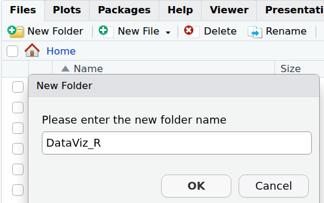
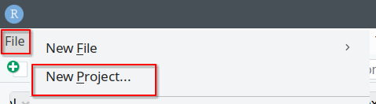
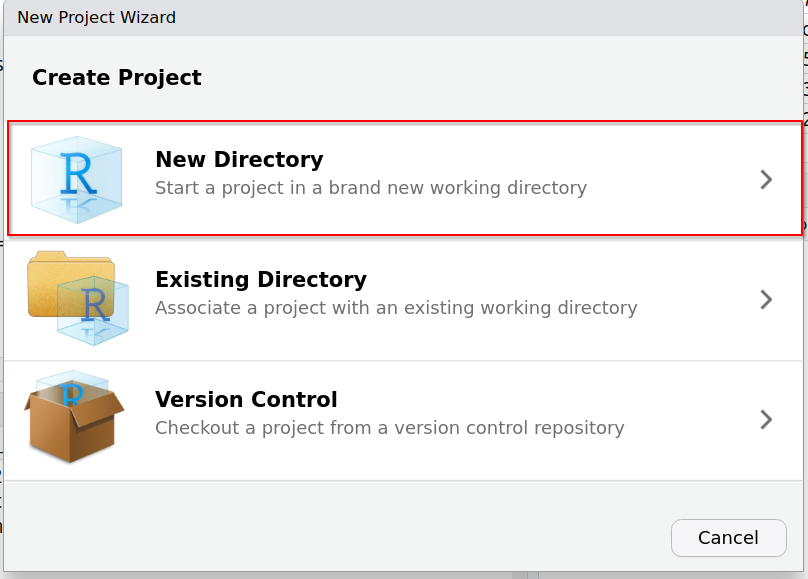
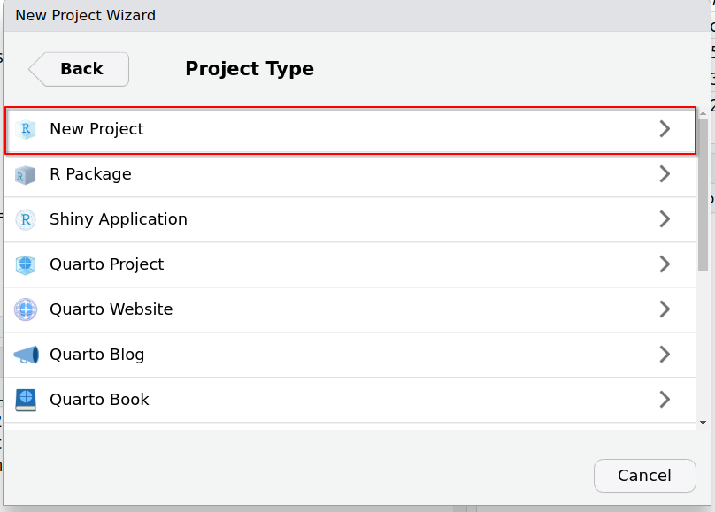
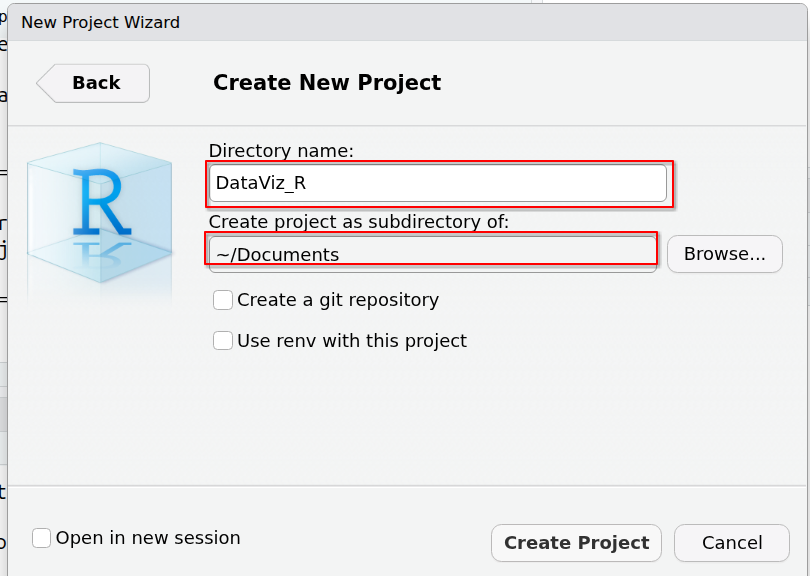
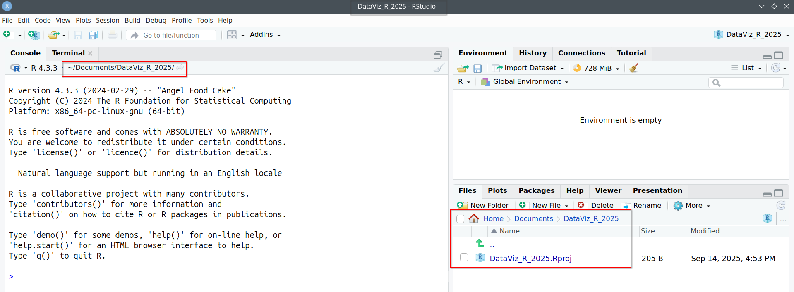
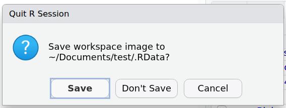
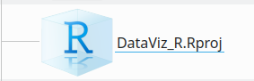

# Paths and directories

## Path and home directory

* The path of a file/directory is its **location/address** in the file system.

* The home directory is the personal directory assigned to the **user (you)**: path and name to the home directory are similar, although not identical, in all operating systems, for example:
  - */users/sbonnin* or */home/sbonnin* (Linux)
  - */Users/sbonnin* or */Home/sbonnin* (macOS)
  - *C:\\Users\\sbonnin* or *C:\\Home\\sbonnin* (Windows)
  
The initial "/" or "\\" is called the **root**, which is the **top-directory** of the hierarchical file system.

Directories branch from the root directory, and can contain both files and sub-directories.

In the examples above, **sbonnin** is sub-directory of **users** (or Users), which in turns is a sub-directory of the root.

Example of a *tree* / organization of directories:

<!---
## Create the workshop directory

We will now create a folder/directory, where we will store what we produce during this course.

Go to the **Files** tab in the bottom-right corner: by default, this will be set to your **Home**.

You can navigate through the *tree* of files and directories by double clicking one folder name, to enter it, and by clicking on the **double dot ".."** to go back.

Choose the folder under which you would like to save the workshop's work.

For example, you can create it right under **Home -> Documents** (or anywhere else that you will remember, as we do not have the same folder structures). 

Click on "Home" and then on "Documents":

Create a folder called **"DataViz_R"** by clicking on the **"+Folder"** icon.

Click on the newly created "DataViz_R" folder under the "Files" tab, so as to enter it. 

Click on the **"More file commands button"**: 

Click on **"Set As Working Directory"**:

The [working directory](https://en.wikipedia.org/wiki/Working_directory) is where R will, by default, find files to read, and that is where it will also save files and figures, if another location/path is not specified.

-->

## RStudio "Projects"

"[RStudio projects](https://support.posit.co/hc/en-us/articles/200526207-Using-RStudio-Projects) are associated with R working directories. You can create an RStudio project:

* __In a brand new directory__
* In an existing directory where you already have R code and data
* By cloning a version control (Git or Subversion) repository
"

### Advantages

* When re-opening a project, all the environment (path, objects) is restored (no data loss)
* Multiple projects can be created in parallel, keeping objects and environment separated (no project "cross-contamination")

### Project for the course

We will create an RStudio "Project" for this workshop. This will allow us to stay organized and easily open the project and associated data.

To create a project:

* Go to File -> New Project...

* Create Project: "New directory"

* Project Type: "New project"

* Create New Project:
  * Choose directory name, e.g. **`DataViz_R`**
  * Navigate to the directory where you want the R project to be created and stored. Here, we can choose **`~/Documents`**:

* A new session has now been started, where the working directory is automatically set to the directory where you chose your project to be stored:

### Leave the project

When you close the RStudio project, make sure you save .RData file (environment):

We will see it in practice as we finish day 1.

### Re-open the project

In the project folder, double-click on the **.Rproj** file, e.g. DataViz_R.Rproj:

Note that, when re-opening a project, all environment is restored but you will **need to reload packages**.

